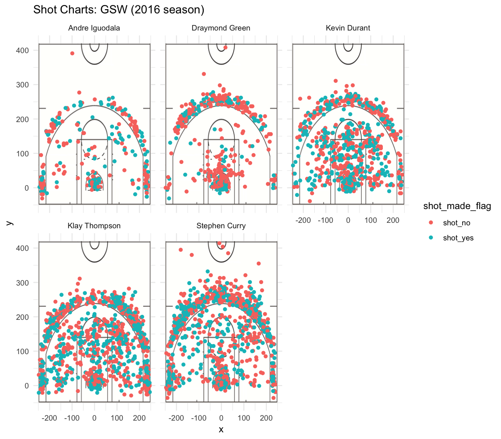

Workout 1
================
Jarelly Martin
3/12/2019

#### Introduction

The Golden State Warriors are no strangers to winning as they are currently lead the Western Conference with a 45-21 record. Do they have what it takes to win this year’s NBA Champion and get away with another consecutive victory? But before we start looking forward to what the Golden State Warriors have in store for the next couple of months, let’s recap their past monumental seasons starting with 2015-2016.

In their 2015-2016 season, Golden State broke records left and right. During this season they broke Chicago Bull’s 1995-1996 season record of 72-10 with their record of 73-9. Not to mention, they had the most road wins in a regular season, most three-pointers in a regular season, longest home winning streak, and many more!

#### Motivation & Background

Looking back at the Golden State Warrior’s 2015-2016 it is safe to say they were unstoppable. In this report, I will dive deep into the player’s shooting record using visuals and statistical analysis. In using visuals I was able to map the player’s shot location on the court and whether the shot was made or not. With the help of statistical analysis, I created three tables to indicate 2-point, 3-point, and overall effective shooting percentage for each player. Below you can see the data visualization and the three tables:

#### Data & Data Analysis

I only had shooting data for the following Golden State Warrior players: Andre Iguodala, Graymond Green, Kevin Durant, Klay Thompson, and Stephen Curry. In order to conduct my analysis, I specifically looked at the shot type (2-point v. 3-point), shot made (yes or no), and shot location (x and y coordinate).

First, let’s take a look at the facetted graphic below that showcases the shot, shot location, and if shot was made or not for each individual player.

 Looking at the shot map for each player we can see come considerable differences. In particular, Stephen Curry's shot map is representative of his style of play since he is famously known for his 3-pointers. Based on the map there's a lot of points across the 3-point line as appose to someone like Andre Iguodala who doesn't shoot as many 3-pointers. Another thing to notice is that a lot of Kevin Durant’s shots are concentrated inside the 3-point line and near the paint in comparison to the other four players. Even though they do not lead 3-pointers this doesn't take away from their abilities as star players. 

Next, let’s take a look at the tables below for 2-point, 3-point, and overall effective shooting percentage for each player.

``` r
library(dplyr)
```

    ## 
    ## Attaching package: 'dplyr'

    ## The following objects are masked from 'package:stats':
    ## 
    ##     filter, lag

    ## The following objects are masked from 'package:base':
    ## 
    ##     intersect, setdiff, setequal, union

``` r
library(ggplot2)
shots_data <- read.csv("../data/shots_data.csv", stringsAsFactors = FALSE)
```

##### 2PT Effective Shooting % by Player

``` r
twoPts <- shots_data[shots_data$shot_type == "2PT Field Goal", ]
arrange(summarise(group_by(twoPts, name), total = length(shot_made_flag), 
                  made = sum(shot_made_flag == 'shot_yes'), 
                  perc_made = 100*made/total), desc(perc_made))
```

    ## Warning: `as_dictionary()` is soft-deprecated as of rlang 0.3.0.
    ## Please use `as_data_pronoun()` instead
    ## This warning is displayed once per session.

    ## Warning: `new_overscope()` is soft-deprecated as of rlang 0.2.0.
    ## Please use `new_data_mask()` instead
    ## This warning is displayed once per session.

    ## Warning: The `parent` argument of `new_data_mask()` is deprecated.
    ## The parent of the data mask is determined from either:
    ## 
    ##   * The `env` argument of `eval_tidy()`
    ##   * Quosure environments when applicable
    ## This warning is displayed once per session.

    ## Warning: `overscope_clean()` is soft-deprecated as of rlang 0.2.0.
    ## This warning is displayed once per session.

    ## # A tibble: 5 x 4
    ##   name           total  made perc_made
    ##   <chr>          <int> <int>     <dbl>
    ## 1 Andre Iguodala   210   134      63.8
    ## 2 Kevin Durant     643   390      60.7
    ## 3 Stephen Curry    563   304      54.0
    ## 4 Klay Thompson    640   329      51.4
    ## 5 Draymond Green   346   171      49.4

##### 3PT Effective Shooting % by Player

``` r
threePts <- shots_data[shots_data$shot_type == "3PT Field Goal", ]
arrange(summarise(group_by(threePts, name), total = length(shot_made_flag), 
                  made = sum(shot_made_flag == 'shot_yes'), 
                  perc_made = 100*made/total), desc(perc_made))
```

    ## # A tibble: 5 x 4
    ##   name           total  made perc_made
    ##   <chr>          <int> <int>     <dbl>
    ## 1 Klay Thompson    580   246      42.4
    ## 2 Stephen Curry    687   280      40.8
    ## 3 Kevin Durant     272   105      38.6
    ## 4 Andre Iguodala   161    58      36.0
    ## 5 Draymond Green   232    74      31.9

##### Overall Effective Shooting % by Player

``` r
arrange(summarise(group_by(shots_data, name), total = length(shot_made_flag), 
                  made = sum(shot_made_flag == 'shot_yes'), 
                  perc_made =100*made/total), desc(perc_made))
```

    ## # A tibble: 5 x 4
    ##   name           total  made perc_made
    ##   <chr>          <int> <int>     <dbl>
    ## 1 Kevin Durant     915   495      54.1
    ## 2 Andre Iguodala   371   192      51.8
    ## 3 Klay Thompson   1220   575      47.1
    ## 4 Stephen Curry   1250   584      46.7
    ## 5 Draymond Green   578   245      42.4

Based on the 2-point effective shooting percentage table, we can see that Andre Iguodala has the highest percentage, 63%, with the least number of shots attempted. Here, Kevin Durant comes at a close second where his 2-pointer shooting percentage is 60.7%. Now let’s take a look at the 3-pointer effective shooting percentage table. Even though Stephen Curry has the highest number of 3-pointer attempts, Klay Thompson beats him with the highest effective shooting percentage of 42.4%. Finally, let’s take a look at the overall shooting percentage and how it compares to 3-pointers and 2-pointers. It turns out that Kevin Durant leads for the highest percentage of shots made when looking at both 2-pointers and 3-pointers.

#### Conclusion

Given my analysis for the shooting percentage of each player, we can see that the Warriors have undoubtedly shaped the current style of play in the NBA. With Stephen Curry and Klay Thompson leading the record for the most 3-pointers in a game it comes to no surprise their shooting percentage record. If they can keep their overall record for effective field-goal percentage as they have in the past seasons, there is no doubt that they can’t take another NBA championship home.

#### References

<https://www.nba.com/article/2017/12/14/one-team-one-stat-warriors-shooting-better-ever>

<https://www.nba.com/news/2015-16-golden-state-warriors-chase-1995-96-chicago-bulls-all-time-wins-record/>

<https://www.interbasket.net/news/19517/2016/03/21-records-that-the-golden-state-warriors-have-broken-this-season/>

<https://www.npr.org/2018/10/30/662120808/klay-thompson-breaks-nbas-3-point-record-held-by-teammate-stephen-curry>

<https://www.washingtonpost.com/sports/2018/10/30/klay-thompsons-threes-just-one-historic-number-warriors-rout/?noredirect=on&utm_term>=.68aa5304e5a8
